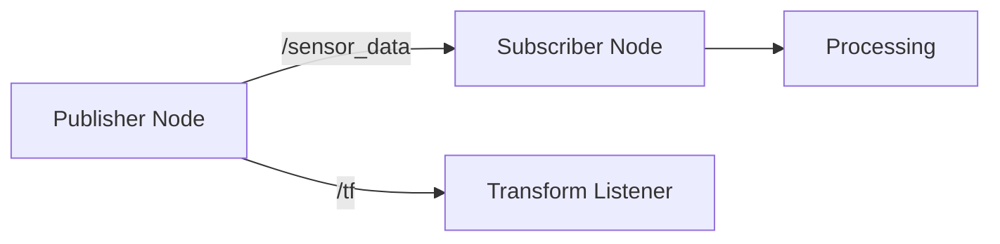
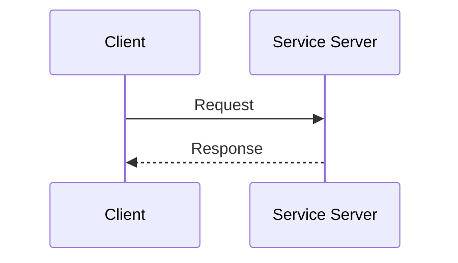

# Diagram Style Guide

This guide defines the visual standards for all diagrams in the Physical AI book. Following these guidelines ensures consistency and accessibility across all chapters.

## Color Palette

### Primary Colors

| Color | Hex | Usage |
|-------|-----|-------|
| **Primary Green** | `#2e8555` | Main elements, headers |
| **Accent Teal** | `#25c2a0` | Highlights, success states |
| **Dark Blue** | `#22314e` | ROS 2 components |
| **Orange** | `#f58113` | Gazebo components |
| **NVIDIA Green** | `#76b900` | Isaac components |
| **Unity Black** | `#000000` | Unity components |

### Status Colors

| Color | Hex | Usage |
|-------|-----|-------|
| **Info Blue** | `#0066cc` | Information callouts |
| **Success Green** | `#28a745` | Completed/working states |
| **Warning Yellow** | `#ffc107` | Cautions, notes |
| **Error Red** | `#dc3545` | Errors, failures |

### Neutral Colors

| Color | Hex | Usage |
|-------|-----|-------|
| **Background Light** | `#f5f7fa` | Diagram backgrounds (light mode) |
| **Background Dark** | `#1e2530` | Diagram backgrounds (dark mode) |
| **Border** | `#e1e4e8` | Element borders |
| **Text** | `#24292e` | Labels and text |

## Shape Standards

### Components

```
┌─────────────────┐
│   Component     │   Rectangle with rounded corners (8px radius)
│   Name          │   Used for: Nodes, services, processes
└─────────────────┘

╭─────────────────╮
│   Database      │   Cylinder shape
│                 │   Used for: Data stores, caches
╰─────────────────╯

◇─────────────────◇
│   Decision      │   Diamond shape
│                 │   Used for: Conditional logic, branching
◇─────────────────◇

(    Circle    )     Circle/ellipse
                     Used for: Start/end points, actors
```

### Arrows and Connectors

| Type | Style | Usage |
|------|-------|-------|
| Data Flow | Solid arrow (`→`) | Message passing, data transfer |
| Control Flow | Dashed arrow (`⇢`) | Control signals, commands |
| Bidirectional | Double arrow (`↔`) | Two-way communication |
| Inheritance | Triangle head (`▷`) | Type relationships |

## Diagram Types

### 1. Architecture Diagrams

**Purpose:** Show system structure and component relationships

**Guidelines:**
- Use layered layout (top-to-bottom or left-to-right)
- Group related components with dashed boxes
- Label all connections with message/topic names
- Include legend for color coding

**Example Structure:**
```
┌──────────────────────────────────────────────────┐
│                Application Layer                 │
│                                                  │
│   ┌──────────┐  ┌──────────┐  ┌──────────┐      │
│   │  Node A  │  │  Node B  │  │  Node C  │      │
│   └────┬─────┘  └────┬─────┘  └────┬─────┘      │
│        │             │             │            │
└────────┼─────────────┼─────────────┼────────────┘
         │             │             │
         └─────────────┼─────────────┘
                       │
                       │ /topic_name
                       │
┌──────────────────────────────────────────────────┐
│                Middleware Layer                  │
│                     DDS                          │
└──────────────────────────────────────────────────┘
```

### 2. Flowcharts

**Purpose:** Show process sequences and decision points

**Guidelines:**
- Flow from top-to-bottom or left-to-right
- Use consistent spacing (40px between elements)
- One decision per diamond
- Label all branches (Yes/No, True/False)

### 3. Sequence Diagrams

**Purpose:** Show temporal interactions between components

**Guidelines:**
- Time flows top-to-bottom
- Label all messages with action names
- Use activation boxes for processing time
- Include response messages

### 4. Data Flow Diagrams

**Purpose:** Show how data moves through the system

**Guidelines:**
- Use arrows to show data direction
- Label with data type (e.g., `sensor_msgs/Image`)
- Show transformations as process boxes
- Include data rates where relevant (e.g., `30 Hz`)

## Typography

### Fonts

| Element | Font | Size | Weight |
|---------|------|------|--------|
| Diagram Title | System Sans | 18px | Bold |
| Component Labels | System Sans | 14px | Medium |
| Connection Labels | System Sans | 12px | Regular |
| Annotations | System Sans | 11px | Italic |

### Text Guidelines

- Use sentence case for labels
- Keep labels concise (2-4 words max)
- Abbreviate common terms (e.g., "msg" for "message")
- Use monospace font for code/commands

## File Formats

### Preferred Formats

| Format | Use Case | Notes |
|--------|----------|-------|
| **SVG** | All diagrams | Scalable, editable, accessible |
| **PNG** | Screenshots | 2x resolution for retina |
| **WebP** | Photos | Better compression than JPEG |

### File Naming Convention

```
[chapter]-[diagram-type]-[description].svg

Examples:
ch03-arch-ros2-node-communication.svg
ch04-flow-sensor-pipeline.svg
ch06-seq-nav2-planning.svg
```

## Accessibility Requirements

### Alt Text Guidelines

Every diagram MUST have descriptive alt text:

**Good Example:**
```markdown

```

**Bad Example:**
```markdown

```

### Alt Text Checklist

- [ ] Describes the diagram type
- [ ] Lists key components
- [ ] Explains relationships/connections
- [ ] Includes relevant data (topic names, frequencies)
- [ ] 20-200 characters in length

### Color Accessibility

- Ensure sufficient contrast (4.5:1 minimum)
- Don't rely on color alone to convey information
- Use patterns or labels as secondary indicators
- Test with color blindness simulators

## Tools Recommended

### Vector Graphics
- **Figma** - Collaborative, web-based
- **Draw.io** - Free, Docusaurus integration
- **Inkscape** - Open source, full-featured

### Diagram-as-Code
- **Mermaid** - Supported in Docusaurus MDX
- **PlantUML** - Sequence and class diagrams
- **Graphviz** - Automatic layout

### Screenshots
- **Flameshot** - Linux annotated screenshots
- **CleanShot** - macOS with annotations

## Mermaid Examples

Docusaurus supports Mermaid diagrams in MDX files:





## Quality Checklist

Before including any diagram:

- [ ] Uses approved color palette
- [ ] Follows shape standards
- [ ] Has descriptive alt text (20-200 chars)
- [ ] SVG format (or PNG at 2x for screenshots)
- [ ] File name follows convention
- [ ] Readable at mobile widths
- [ ] Tested in both light and dark modes

---

*Last updated: 2025-12-11*
