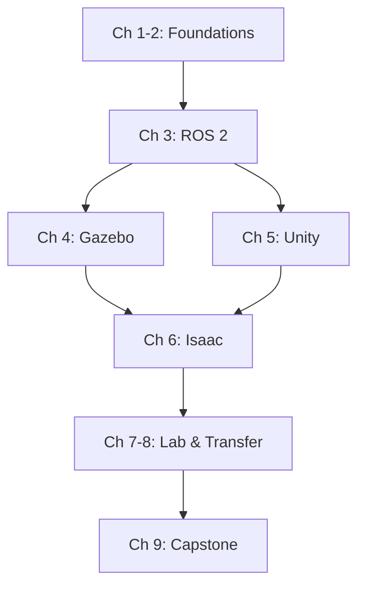

# Introduction to Physical AI

## Learning Objectives

By the end of this chapter, you will be able to:

- Define Physical AI and distinguish it from traditional disembodied AI systems
- Explain the convergence of robotics, simulation, and artificial intelligence
- Navigate the book's learning path and understand module dependencies
- Identify the prerequisites and tools needed for hands-on exercises

---

## What is Physical AI?

Physical AI represents a paradigm shift in artificial intelligence—moving from systems that exist purely in digital space to intelligent agents that perceive, reason, and act in the physical world. Unlike chatbots or recommendation engines, Physical AI systems have bodies, sensors, and actuators that allow them to interact directly with their environment.

The term "embodied intelligence" captures this fundamental insight: intelligence is not just about processing information but about being situated in and interacting with a physical world. A robot navigating a warehouse, a drone avoiding obstacles, or a humanoid responding to voice commands—these systems exemplify Physical AI in action.

:::info Key Distinction
**Disembodied AI**: Processes text, images, or data without physical interaction (e.g., ChatGPT, image classifiers)

**Physical AI**: Senses the environment and takes physical actions (e.g., autonomous robots, self-driving vehicles)
:::

This book focuses on the technologies, frameworks, and techniques that enable Physical AI: robotics middleware (ROS 2), physics simulation (Gazebo, Unity, Isaac), perception systems, and the emerging field of Vision-Language-Action models that bridge natural language understanding with robotic control.

---

## The Convergence of Robotics, Simulation, and AI

Physical AI emerges at the intersection of three rapidly advancing fields:

### Robotics: The Body

Modern robotics provides the physical platform—sensors to perceive the world (cameras, LiDAR, IMUs) and actuators to act upon it (motors, grippers, legs). The Robot Operating System (ROS 2) has become the standard middleware for connecting these components, enabling modular and reusable robot software.

### Simulation: The Training Ground

Real-world robot training is expensive, slow, and potentially dangerous. High-fidelity simulators like Gazebo, Unity, and NVIDIA Isaac Sim allow developers to train perception models, test navigation algorithms, and validate behaviors in virtual environments before deploying to physical hardware. The concept of "digital twins"—virtual replicas of physical systems—enables continuous testing and optimization.

### Artificial Intelligence: The Mind

AI brings perception (computer vision, SLAM), decision-making (planning, reinforcement learning), and increasingly, natural language understanding to robotic systems. Vision-Language-Action (VLA) models like RT-2 and PaLM-E represent the frontier, enabling robots to understand commands like "pick up the red cup and place it on the table" and translate them into motor actions.


*Figure 1.1: Physical AI emerges at the intersection of robotics, simulation, and artificial intelligence*

---

## Book Roadmap

This book is organized into modules that build progressively from foundations to a complete autonomous humanoid system:

| Module | Chapters | Focus | Outcome |
|--------|----------|-------|---------|
| **Foundations** | 1-2 | Embodied intelligence concepts | Theoretical framework |
| **ROS 2** | 3 | Robot Operating System 2 | Working robot nodes |
| **Simulation** | 4-6 | Gazebo, Unity, Isaac | Digital twin environments |
| **Lab Setup** | 7-8 | Hardware and sim-to-real | Development environment |
| **Capstone** | 9 | VLA integration | Autonomous humanoid |

### Learning Path



Each module is designed to be self-contained while building on previous knowledge. You can read the simulation chapters (4-6) in any order, but all assume ROS 2 familiarity from Chapter 3.

---

## Prerequisites and Tools

### Knowledge Prerequisites

This book targets intermediate-to-advanced learners with:

- **Python proficiency**: Comfortable with classes, decorators, async programming
- **Basic linear algebra**: Vectors, matrices, transformations
- **Command-line familiarity**: Terminal navigation, package management
- **Optional**: Prior robotics or ROS 1 experience (helpful but not required)

### Software Requirements

| Tool | Version | Purpose |
|------|---------|---------|
| Ubuntu | 22.04 LTS | Primary OS |
| ROS 2 | Humble | Robot middleware |
| Gazebo | Fortress | Physics simulation |
| Python | 3.10+ | Development language |

:::tip Windows Users
Windows users can follow along using WSL2 (Windows Subsystem for Linux) with Ubuntu 22.04. See the [Installation Guide](./appendix/installation) for setup instructions.
:::

### Hardware Recommendations

| Tier | Specs | Capabilities |
|------|-------|--------------|
| **Minimum** | 16GB RAM, GTX 1660 | ROS 2 + Gazebo |
| **Recommended** | 32GB RAM, RTX 3070 | + Unity + Isaac Sim |
| **Optimal** | 64GB RAM, RTX 4080 | Full stack + training |

For readers without GPU access, cloud platforms (AWS RoboMaker, Google Cloud) provide alternatives for simulation-heavy chapters.

---

## How to Use This Book

### Hands-On Approach

Each chapter includes:

- **Learning objectives** at the start
- **Code examples** tested on ROS 2 Humble
- **Practical walkthroughs** with step-by-step instructions
- **Assessments** to validate your understanding

Code examples use consistent formatting with version specifications:

```python title="example_node.py"
# Environment: ROS 2 Humble, Python 3.10+
# Dependencies: rclpy, std_msgs

import rclpy
from rclpy.node import Node

# Your code here
```

### Assessments

Each module concludes with a practical project:

1. **ROS 2 Package Project**: Build a custom node with publishers and subscribers
2. **Gazebo Simulation**: Create a robot with sensors in a virtual world
3. **Isaac Perception**: Deploy GPU-accelerated perception pipelines
4. **Capstone**: Build a voice-controlled autonomous humanoid

---

## Summary

Physical AI represents the convergence of robotics, simulation, and artificial intelligence into systems that perceive and act in the physical world. This book provides a comprehensive guide to the technologies enabling this revolution:

- **ROS 2** provides the communication backbone
- **Simulation** (Gazebo, Unity, Isaac) enables safe development and training
- **AI** (perception, planning, VLA) provides intelligence
- **Sim-to-real** techniques bridge the gap to physical deployment

In the next chapter, we explore the theoretical foundations of embodied intelligence—why having a body fundamentally changes what it means to be intelligent.

---

## References

1. Brooks, R. A. (1991). Intelligence without representation. *Artificial Intelligence*, 47(1-3), 139-159. https://doi.org/10.1016/0004-3702(91)90053-M

2. Pfeifer, R., & Bongard, J. (2006). *How the Body Shapes the Way We Think: A New View of Intelligence*. MIT Press.

3. Macenski, S., Foote, T., Gerkey, B., Lalancette, C., & Woodall, W. (2022). Robot Operating System 2: Design, architecture, and uses in the wild. *Science Robotics*, 7(66), eabm6074. https://doi.org/10.1126/scirobotics.abm6074

4. Brohan, A., et al. (2023). RT-2: Vision-Language-Action Models Transfer Web Knowledge to Robotic Control. *arXiv preprint arXiv:2307.15818*.

5. Open Robotics. (2022). ROS 2 Documentation: Humble Hawksbill. https://docs.ros.org/en/humble/

---

*Word count: ~1,150 words*
